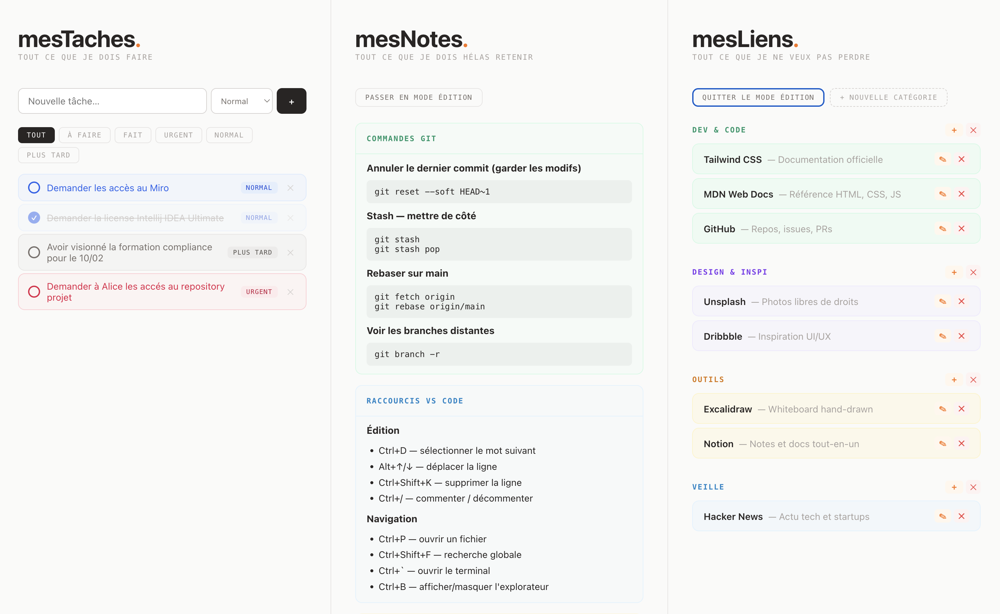

# mesTaches. mesNotes. mesLiens.

> Un mini-dashboard de productivité en trois colonnes — zéro dépendance, zéro serveur, zéro compromis sur la sécurité.

## Sécurité — pourquoi ce projet peut être utilisé partout

C'est l'un des atouts majeurs de ce dashboard. Voici pourquoi il ne représente **aucun risque** dans un environnement sécurisé :

| Critère              | Ce projet                                                                     |
| -------------------- | ----------------------------------------------------------------------------- |
| Requêtes réseau      | **Aucune** — pas de CDN, pas d'API, pas de tracking                           |
| Dépendances externes | **Aucune** — HTML, CSS et JavaScript Vanilla uniquement                       |
| Serveur requis       | **Non** — s'ouvre directement via `file://` dans le navigateur                |
| Données envoyées     | **Jamais** — tout reste sur votre machine (`localStorage` et fichiers locaux) |
| Installation         | **Aucune** — pas d'exécutable, pas de package, pas de droits admin            |
| Code auditables      | **Oui** — quelques fichiers lisibles, rien de minifié ni d'obfusqué           |

> **En pratique** : vous pouvez ouvrir ce fichier sur un poste isolé, dans un réseau sans accès internet, dans un environnement à politique de sécurité stricte (DSI, défense, finance, santé…). Il ne tente aucune connexion sortante, ne charge rien de l'extérieur, et ne stocke vos données que là où vous décidez de les stocker.

---



## Pourquoi ce projet ?

Certains environnements de travail sont **hautement sécurisés** : pas d'accès aux outils classiques de suivi des tâches, pas d'accès aux CDN, pas de possibilité d'installer quoi que ce soit.

Et pourtant, votre productivité dépend de votre capacité à **consigner vos tâches**, vos **notes** et vos **liens utiles** quelque part, puis à les retrouver chaque matin.

Ce projet résout ce problème : un **unique fichier HTML** que vous déposez sur votre bureau et qui fonctionne dans n'importe quel navigateur, même hors ligne.

---

## Les trois colonnes

### mesTaches. — Gestionnaire de tâches

Ajoutez des tâches en un instant, triez-les par priorité, cochez-les au fil de la journée.

- Trois niveaux de priorité : **Urgent**, **Normal**, **Plus tard**
- Filtres par statut : Tout, À faire, Fait, Urgent, Normal, Plus tard
- Case à cocher pour marquer une tâche comme terminée
- Suppression individuelle

### mesNotes. — Bloc-notes structuré

Tout ce que vous devez hélas retenir, organisé en notes composées de blocs librement empilables.

- Quatre types de blocs par note :
  - **Titre** — texte court mis en gras pour structurer
  - **Texte** — paragraphe libre
  - **Code** — bloc monospace à fond gris (commandes, regex, snippets…)
  - **Liste** — bullet points
- Chaque note a une couleur personnalisable
- Ajout, modification et suppression de notes et de blocs en mode édition

### mesLiens. — Répertoire de liens utiles

Vos liens organisés par catégories, accessibles en un clic.

- Catégories personnalisables avec couleur au choix
- Affichage avec nom et description
- Ajout, modification et suppression en mode édition

---

## Persistance des données

Tout est sauvegardé dans le `localStorage` du navigateur — vos contenus survivent à la fermeture du navigateur.

Pour ne pas perdre vos données si vous videz le cache ou changez de machine, chaque panel dispose d'un bouton **"enregistrer les modifications"** qui écrase le fichier source (`mesLiens.js` ou `mesNotes.js`) directement sur votre disque, grâce à la **File System Access API** (Chrome et Edge Chromium uniquement).

> **Première sauvegarde** : une modale vous demande de sélectionner le dossier du projet. Le fichier est ensuite mis à jour directement à chaque sauvegarde suivante, sans dialogue.

---

## Démarrage rapide

1. Clonez ou téléchargez ce dépôt
2. Ouvrez le fichier `liens-utiles.html` dans Chrome ou Edge
3. C'est tout.

```bash
git clone https://github.com/ymedaghri/liens-utiles.git
cd liens-utiles
open liens-utiles.html   # macOS
# ou
start liens-utiles.html  # Windows
```

Des exemples sont déjà présents dans chaque panel pour vous donner une idée de ce que vous pouvez y mettre.

---

## Stack technique

| Technologie        | Détail                                                             |
| ------------------ | ------------------------------------------------------------------ |
| HTML               | Structure sémantique, pas de framework                             |
| CSS                | Styles séparés dans `style.css`, aucun framework                   |
| JavaScript         | Vanilla, aucune bibliothèque tierce                                |
| Stockage local     | `localStorage` du navigateur                                       |
| Stockage fichier   | File System Access API (`showDirectoryPicker`)                     |
| Persistance handle | `IndexedDB` — le handle du fichier est mémorisé entre les sessions |

---

## Auteur

**Youssef MEDAGHRI-ALAOUI**
[craftskillz.com](https://www.craftskillz.com/posts/stay-secure-and-productive)

---

## Licence

Ce projet est distribué sous licence **MIT** — vous pouvez l'utiliser, le modifier et le redistribuer librement, y compris dans des projets commerciaux, à condition de conserver la mention de l'auteur original.
